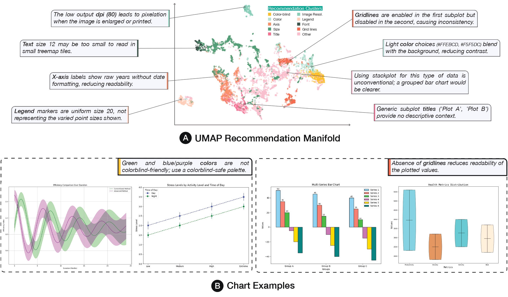

# De-rendering, Reasoning, and Repairing Charts with Vision-Language Models

> Proceedings of the Latinx in AI Workshop @ NeurIPS 2025  
> **Valentín Bonás, Martín Sinnona, Viviana Siless, Emmanuel Iarussi**  
> Universidad Torcuato Di Tella · CONICET · Universidad de Buenos Aires  

[](https://arxiv.org/abs/XXXX.XXXXX)
[](https://visdecode.ai)

---

## Abstract

Data visualizations are central to scientific communication, journalism, and everyday decision-making, yet they are frequently prone to errors that can distort interpretation or mislead audiences. Rule-based visualization linters can flag violations, but they miss context and do not suggest meaningful design changes. Directly querying general-purpose LLMs about visualization quality is unreliable: lacking training to follow visualization design principles, they often produce inconsistent or incorrect feedback.

In this work, we introduce a framework that combines chart de-rendering, automated analysis, and iterative improvement to deliver actionable, interpretable feedback on visualization design. Our system reconstructs the structure of a chart from an image, identifies design flaws using vision-language reasoning, and proposes concrete modifications supported by established principles in visualization research. Users can selectively apply these improvements and re-render updated figures, creating a feedback loop that promotes both higher-quality visualizations and the development of visualization literacy.

In our evaluation on 1,000 charts from the Chart2Code benchmark, the system generated 10,452 design recommendations, which clustered into 10 coherent categories (e.g., axis formatting, color accessibility, legend consistency). These results highlight the promise of LLM-driven recommendation systems for delivering structured, principle-based feedback on visualization design.

---

## Key Contributions

- 🔄 Unified pipeline for **chart de-rendering, critique, and refinement**
- 🖼️ Chart-to-code reconstruction using **ChartCoder**
- 🧠 Vision-language reasoning for structured design critique
- ✍️ Human-in-the-loop interactive improvement workflow
- 📊 Large-scale evaluation on 1,000 Chart2Code benchmark charts
- 🧩 10,452 recommendations organized into 10 coherent semantic clusters

---

## System Overview

The framework operates in three stages:

### 1️⃣ Chart Deconstruction

- Input: Raster chart image  
- Model: **ChartCoder**
- Output: Executable Python (Matplotlib) code  

The recovered code exposes explicit visual encodings (axes, scales, legends, marks, text), enabling structured downstream reasoning.

---

### 2️⃣ Recommended Updates

- Model: GPT-OSS 20B (via Ollama)
- Input: Reconstructed plotting code
- Output: Structured, one-line design recommendations

The system focuses strictly on **visual design issues**, ignoring coding errors.  
Each recommendation is produced as a single structured line to ensure clarity and parseability.

---

### 3️⃣ Interactive Refinement

- Users select which recommendations to apply
- Code is automatically edited
- Visualization is re-rendered
- The system re-analyzes the updated chart

This creates a continuous **feedback loop** that balances automated guidance with human judgment and supports progressive refinement.

---

## Recommendation Manifold

<p align="center">
  
</p>

**Figure.** UMAP projection of the 1,536-dimensional embeddings of 10,452 generated visualization design recommendations.

Each point corresponds to a recommendation produced by the system.  
Semantically similar critiques naturally cluster into coherent groups, including:

- Axis formatting and labeling  
- Color accessibility (colorblind-safe palettes)  
- Legend consistency  
- Gridline usage  
- Title clarity  
- Font size and readability  
- Image resolution  
- Encoding appropriateness  

Representative chart examples (bottom) illustrate how specific issues — such as low contrast colors, inconsistent gridlines, small text sizes, or inappropriate chart types — align with structured regions in the embedding space.

The emergence of well-separated clusters indicates that the system captures meaningful visualization principles rather than isolated or superficial critiques.

---

## Evaluation

We evaluated the framework on:

- **1,000 chart images**
- From the **Chart2Code benchmark**
- Covering bars, lines, scatters (2D and 3D)

### Results

- Generated **10,452 structured design recommendations**
- Embedded into 1,536-dimensional space
- Clustered into **10 coherent semantic groups**
- Davies–Bouldin score: **3.30**

The structured organization prevents overwhelming users with flat feedback lists and instead presents interpretable categories of improvement grounded in visualization best practices.

---

## Citation

If you use this work, please cite:

```bibtex
@inproceedings{
}
